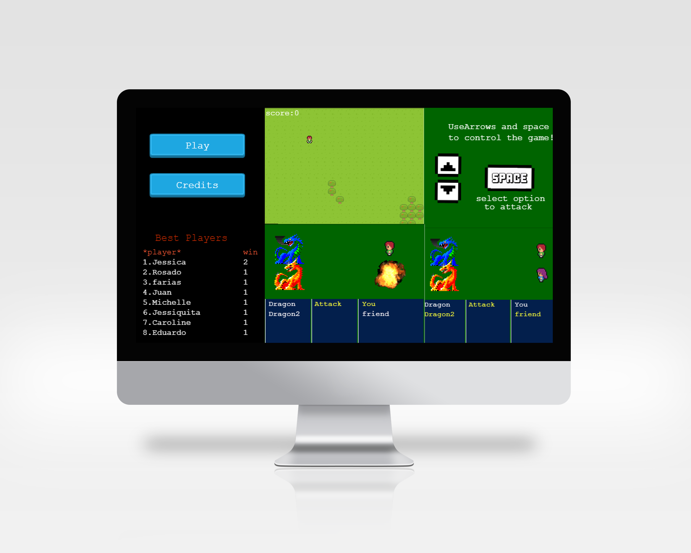

  <h1 align="center">Role Playing Gamming (RPG Game)</h1>

  

    Based on javascript this is role-playing gaming, you need to fight with dragons.
    To control the game use space and arrows of the keyboard to move in the menu, select attack with space then select which dragon you want to attack with a move up and down with arrows of the keyboard, each player has a random damage attack.
  

## Screenshots:

### Youtube video : 
 - [Click here](https://youtu.be/K2DuumEOU94)

# Game instructions:
 > Click on "play" to start the game

### World scene
  - Use the keyboard arrows to move right left up and down

### Battle scene
  - Use space when you are ready to attack (choose attack)
  - Now you should be in the left menu, Up and Down to point the dragon (choose dragon)
  - Use space again to attack the dragon that you are pointing (attack dragon)

### GameOver
  - After you losse the battle, you should write your name (you need at least 1 win to include your name in the score table)

## Live Demo : 
[Click here](https://eloquent-volhard-65590d.netlify.app/)

## Built with

- HTML
- JavaScript
- Webpack
- Phaser3
- Jest
- Babel

## Setup and run the app

> Follow these steps to set up and run the quickstart:
  - Clone/Download this repo and open this folder in a Terminal.
    `https://github.com/jessicafarias/Game.git`
  - Install the Nodejs:
  [https://nodejs.org/en/download/](https://nodejs.org/en/download/)

  - Run npm install on your terminal *be sure that you are in the project's directory*:
  `npm install`
  - Finally run a local server using chrome:
  `npm run start` or `yarn run webpack-dev-server`
  - Go http://localhost:8080/

## Setup and run the app
> Follow these steps to set up and run the quickstart:
  - `npm run test`
  - Go the terminal to see all pass tests

## Author

👤 **Jessica Michelle Farías Rosado**

  
  
  
  

## 🤝 Contributing

Contributions, issues and feature requests are welcome!

Feel free to check the [issues page](https://github.com/jessicafarias/Game/issues).

## Show your support

Give a ⭐️ if you like this project!